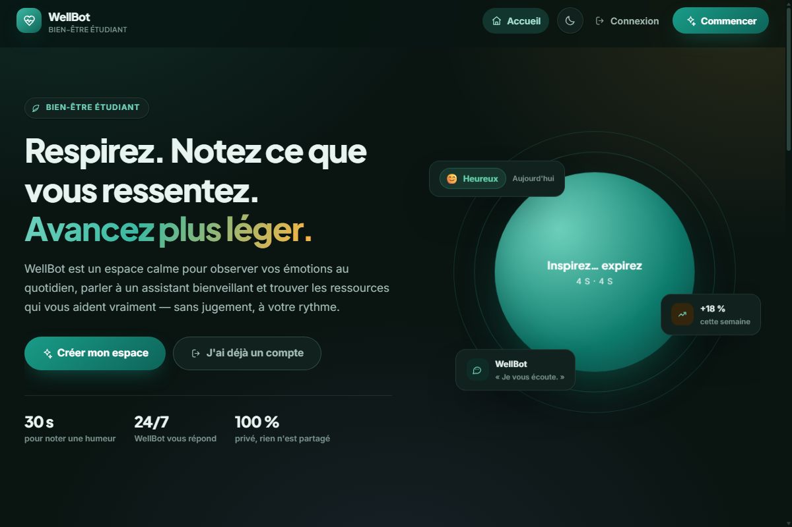
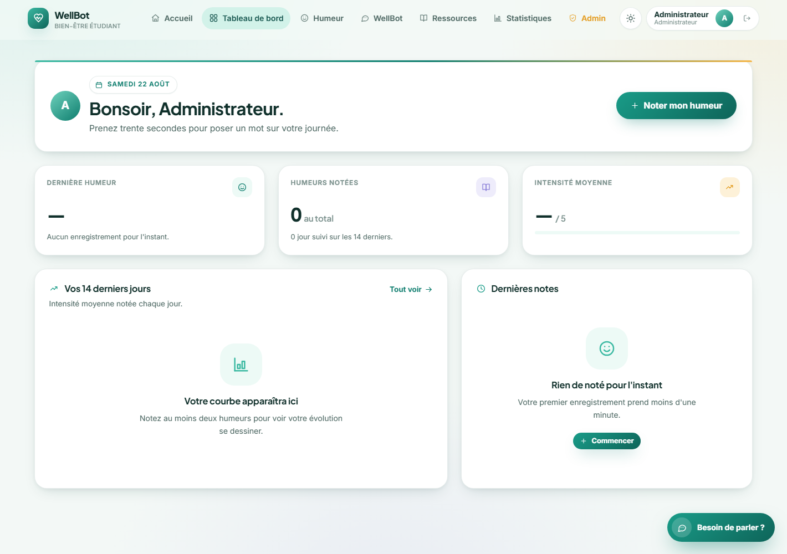
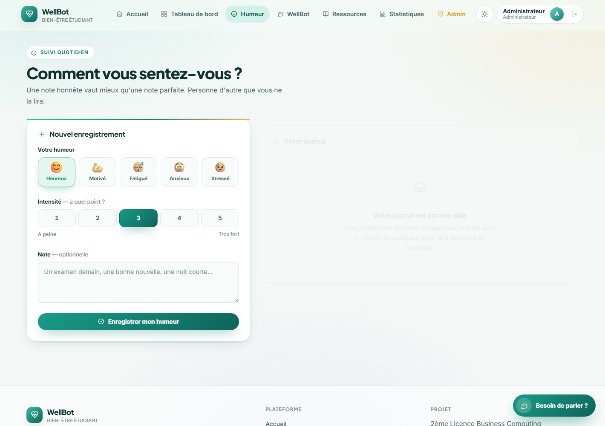
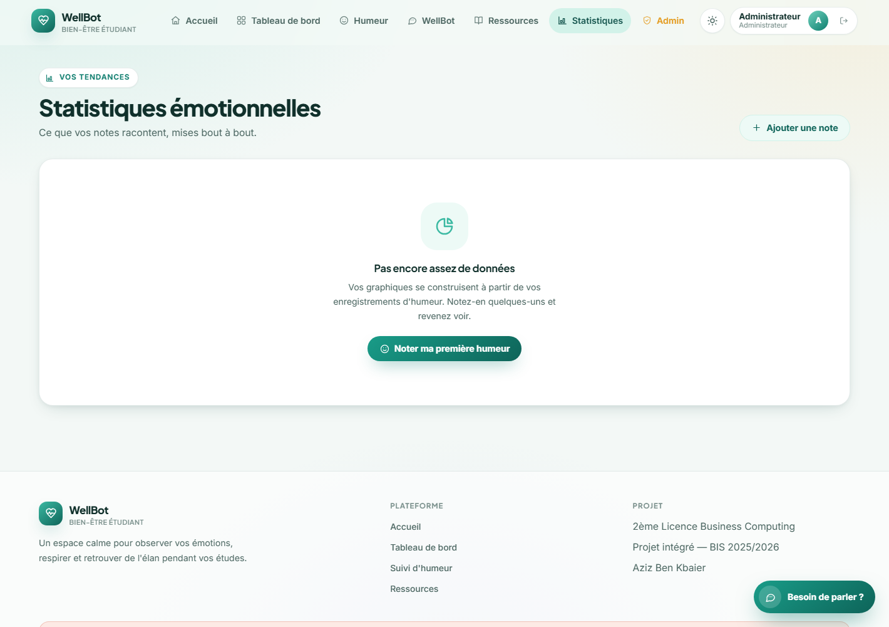
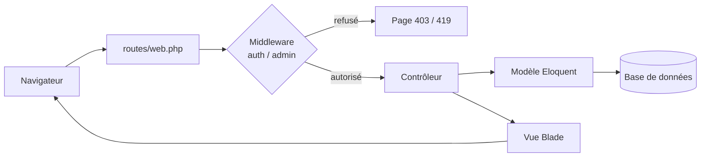
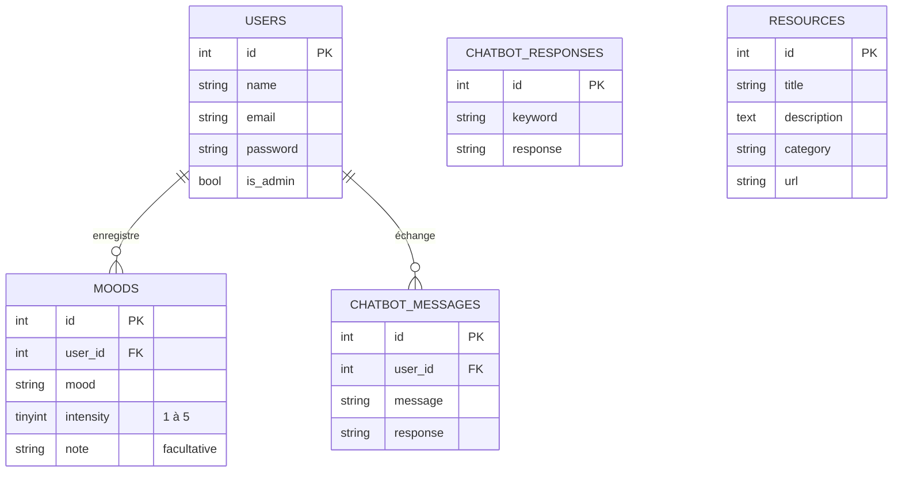
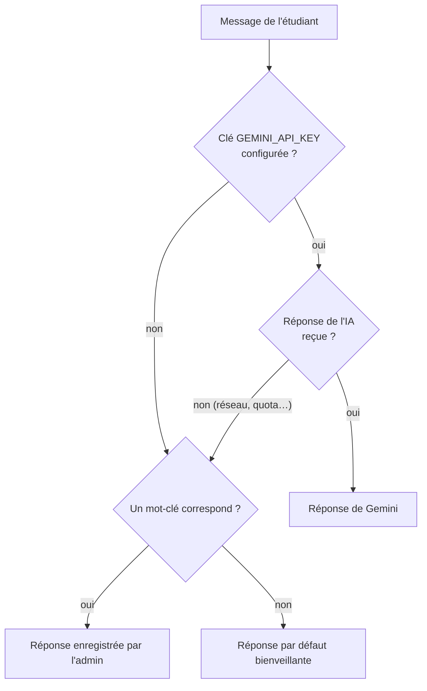

# WellBot — Plateforme de bien-être étudiant

Une application web pour aider les étudiants à suivre leur humeur au quotidien,
discuter avec un assistant bienveillant et trouver des ressources concrètes
contre le stress, le manque de sommeil ou la démotivation.

> Projet intégré — 2ème Licence Business Computing (BIS) — Année 2025/2026



---

## Sommaire

- [Fonctionnalités](#fonctionnalités)
- [Aperçu](#aperçu)
- [Stack technique](#stack-technique)
- [Comment ça marche](#comment-ça-marche)
- [Structure du projet](#structure-du-projet)
- [Modèle de données](#modèle-de-données)
- [Les trois niveaux de WellBot](#les-trois-niveaux-de-wellbot)
- [Qui a le droit de faire quoi](#qui-a-le-droit-de-faire-quoi)
- [Installation](#installation)
- [Système de design](#système-de-design)
- [Documents du projet](#documents-du-projet)
- [Auteurs](#auteurs)

---

## Fonctionnalités

| | Fonctionnalité | Description |
|---|---|---|
| 🔐 | **Comptes sécurisés** | Inscription et connexion, mots de passe hachés (bcrypt) |
| 😊 | **Suivi de l'humeur** | 5 humeurs, une intensité de 1 à 5, une note libre — créer, modifier, supprimer |
| 💬 | **Assistant WellBot** | Chatbot propulsé par Google Gemini, avec repli automatique sur des mots-clés |
| 📚 | **Bibliothèque de ressources** | Conseils et liens classés par thème, gérés par les administrateurs |
| 📊 | **Statistiques** | Répartition des humeurs et évolution de l'intensité (Chart.js) |
| 🛡️ | **Espace administrateur** | Chiffres de la plateforme, gestion des comptes et des mots-clés du chatbot |
| 🌗 | **Thème clair / sombre** | Choix mémorisé dans le navigateur, appliqué avant le premier rendu |

## Aperçu

| Tableau de bord | Suivi de l'humeur | Statistiques |
|---|---|---|
|  |  |  |

## Stack technique

| Couche | Technologie | Pourquoi |
|---|---|---|
| Back-end | **PHP 8.1+ / Laravel 10** | Routage, ORM Eloquent, validation, sessions |
| Vues | **Blade** | Templates serveur, aucun build front à lancer |
| Styles | **Bootstrap 5 + `wellbot.css`** | Grille de Bootstrap, identité visuelle maison |
| Graphiques | **Chart.js 4** | Courbes et anneaux du suivi d'humeur |
| Base de données | **SQLite** (ou MySQL) | Zéro installation en développement |
| IA | **Google Gemini** *(facultatif)* | Réponses du chatbot ; sans clé, repli sur mots-clés |

Aucune étape de compilation : pas de `npm run build`, pas de bundler.
Les feuilles de style et scripts sont servis tels quels depuis `public/`.

## Comment ça marche

Une requête traverse toujours les mêmes étapes :



Concrètement, pour « j'enregistre mon humeur » :

1. Le formulaire de `resources/views/mood.blade.php` envoie un `POST /moods`.
2. `routes/web.php` vérifie que l'étudiant est connecté (`middleware('auth')`).
3. `MoodController@store` valide les champs et crée un `Mood` lié à l'utilisateur.
4. Redirection vers `/moods` avec un message de confirmation.
5. La vue réaffiche le journal, chaque humeur rendue par le composant `<x-mood-chip>`.

Le chatbot suit le même chemin, à une différence près : le contrôleur délègue
la rédaction de la réponse au service `WellBotResponder` (voir plus bas).

## Structure du projet

Seuls les dossiers propres au projet sont détaillés ; le reste est le squelette
standard de Laravel.

```
WellBot/
├── app/
│   ├── Http/
│   │   ├── Controllers/
│   │   │   ├── AuthController.php        Inscription, connexion, déconnexion
│   │   │   ├── DashboardController.php   Tableau de bord + page statistiques
│   │   │   ├── MoodController.php        CRUD du suivi d'humeur
│   │   │   ├── ChatbotController.php     Reçoit et affiche la conversation
│   │   │   ├── ResourceController.php    CRUD de la bibliothèque
│   │   │   └── AdminController.php       Espace administrateur
│   │   └── Middleware/
│   │       └── EnsureUserIsAdmin.php     Alias « admin » : filtre les non-admins
│   ├── Models/                           User, Mood, ChatbotMessage,
│   │                                     ChatbotResponse, Resource
│   ├── Providers/
│   │   └── AppServiceProvider.php        Injecte l'historique dans la bulle WellBot
│   └── Services/
│       └── WellBotResponder.php          Cerveau du chatbot (Gemini → mots-clés)
│
├── config/
│   ├── moods.php                         Source unique des 5 humeurs
│   └── services.php                      Clé API Gemini
│
├── database/
│   ├── migrations/                       Schéma des tables
│   └── seeders/                          Compte admin, ressources, mots-clés
│
├── public/
│   ├── css/wellbot.css                   Système de design complet
│   └── js/wellbot.js                     Thème, bulle WellBot, thème Chart.js
│
├── resources/views/
│   ├── layouts/app.blade.php             Gabarit commun (nav, pied de page)
│   ├── components/                       x-icon, x-mood-chip,
│   │                                     x-intensity-dots, x-empty-state
│   ├── partials/                         Icônes SVG, messages flash, bulle WellBot
│   ├── errors/                           Pages 403, 404, 419, 500, 503
│   ├── auth/                             Connexion, inscription
│   ├── admin/                            Espace administrateur
│   └── *.blade.php                       Accueil, tableau de bord, humeur,
│                                         chatbot, ressources, statistiques
│
├── routes/web.php                        Toutes les routes et leurs permissions
└── docs/                                 Livrables : cahier des charges, UML, MLD
```

### Où regarder en premier

| Vous cherchez… | Ouvrez |
|---|---|
| La liste des pages et qui y a accès | `routes/web.php` |
| Comment le chatbot choisit sa réponse | `app/Services/WellBotResponder.php` |
| Les couleurs, polices et composants | `public/css/wellbot.css` |
| Les humeurs (emoji, couleur, libellé) | `config/moods.php` |
| Le gabarit de toutes les pages | `resources/views/layouts/app.blade.php` |

## Modèle de données



`chatbot_responses` et `resources` ne dépendent d'aucun utilisateur : ce sont
des contenus communs, alimentés par les administrateurs.
Supprimer un compte supprime en cascade ses humeurs et ses conversations.

## Les trois niveaux de WellBot

Le chatbot ne tombe jamais en panne : si un niveau échoue, le suivant prend le relais.
Toute cette logique tient dans un seul fichier, `app/Services/WellBotResponder.php`.



Pour les mots-clés, **le plus long gagne** : ainsi « pas bien » l'emporte sur « bien ».

## Qui a le droit de faire quoi

Les permissions se lisent directement dans `routes/web.php`.

| Zone | Visiteur | Étudiant connecté | Administrateur |
|---|:---:|:---:|:---:|
| Accueil, connexion, inscription | ✅ | ✅ | ✅ |
| Tableau de bord, humeur, statistiques | ❌ | ✅ | ✅ |
| Chatbot WellBot | ❌ | ✅ | ✅ |
| Consulter les ressources | ❌ | ✅ | ✅ |
| Créer / modifier / supprimer une ressource | ❌ | ❌ | ✅ |
| Espace admin, comptes, mots-clés | ❌ | ❌ | ✅ |

Un étudiant ne voit et ne modifie **que ses propres** humeurs et conversations :
les contrôleurs comparent systématiquement `user_id` à l'utilisateur connecté.

## Installation

Prérequis : **PHP 8.1+** et **Composer**.

```bash
# 1. Dépendances
composer install

# 2. Configuration
cp .env.example .env        # sous Windows : copy .env.example .env
php artisan key:generate

# 3. Base de données SQLite
type nul > database\database.sqlite     # sous Linux/macOS : touch database/database.sqlite
php artisan migrate --seed

# 4. Démarrage
php artisan serve
```

Ouvrir <http://localhost:8000>.

**Compte de démonstration** créé par les seeders :

| Email | Mot de passe |
|---|---|
| `admin@bienetre.tn` | `admin123` |

**Activer l'IA (facultatif)** — récupérer une clé gratuite sur
[Google AI Studio](https://aistudio.google.com/app/apikey) et la coller dans `.env` :

```env
GEMINI_API_KEY=votre_cle_ici
```

Sans clé, le chatbot reste pleinement fonctionnel grâce aux mots-clés.

Le détail pas à pas, y compris l'option MySQL / phpMyAdmin, se trouve dans
[INSTRUCTIONS.md](INSTRUCTIONS.md).

## Système de design

L'interface suit un thème « santé et sérénité » : vert d'eau apaisant, accents
soleil et lavande, angles arrondis, animations lentes (cercle de respiration,
apparition progressive des blocs).

- **Tous les styles** sont dans [`public/css/wellbot.css`](public/css/wellbot.css),
  organisé en 19 sections commentées.
- **Changer la couleur principale** du site : modifier les variables
  `--wb-brand-*` en haut du fichier, rien d'autre.
- **Mode sombre** : les mêmes variables sont redéfinies sous `[data-bs-theme="dark"]`.
- **Accessibilité** : contrastes vérifiés, focus visible, `prefers-reduced-motion`
  respecté, et les animations d'apparition ne se déclenchent que si JavaScript
  répond (sinon le contenu reste visible).

## Documents du projet

Le dossier [`docs/`](docs/) contient les livrables académiques :

| Fichier | Contenu |
|---|---|
| `Cahier_des_charges.docx` / `.txt` | Cahier des charges complet |
| `Comment_pitcher_le_projet.docx` | Guide de la présentation orale |
| `diagramme_admin.svg` | Diagramme de cas d'utilisation (administrateur) |
| `schema_base_de_donnees.svg` | Modèle logique de données |
| `screenshots/` | Captures utilisées dans ce README |

## Auteurs

Feres Kbayer · Achref Louati · Med Sleh Amdouni · Hakim Louleb · Louay Sakli

---

> ⚠️ WellBot est un projet étudiant. Il n'a pas vocation à remplacer un
> professionnel de santé. En cas de détresse, contactez les services d'urgence
> de votre pays ou le service de santé de votre université.
